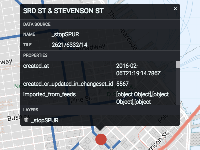
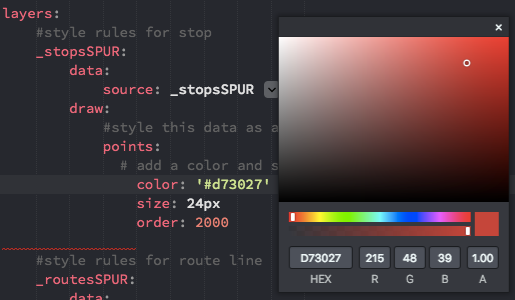

# Make your own transit map with Tangram Play

Maps of transit routes exist for San Francisco, but these show the entire transit system. What if you are only interested in the bus stops and routes near SPUR? You can make your own map by choosing the data you want to show.

In this exercise, you will be introduced to how you could make your own transit map with Tangram Play, which is an interactive text editor for making maps.

All you need is a browser and an internet connection while you are working. No special knowledge of coding or transit data is needed.

## Make a custom transit map

You will open a map in Tangram Play with route lines and a transit stop near SPUR. With Tangram Play, you can write and edit map styles and preview the changes live in the web browser. Tangram Play has two main interface components: the map preview and the editing pane. The map preview will show any changes made by writing in the editing pane on the fly.

1. Open http://bit.ly/2rXrqfx in a new browser tab. This is a shortened link to a Tangram Play map, which opens to display a basemap with several transit-related layers.

  

2. Click `Inspect` on the toolbar at the top to enable a mode where you can get attributes about the features you click.

  

3. Hover over features on the map, and click the point line to see details about it in a pop-up. If you scroll through the list, you see the properties from the Transitland entity.

  

4. Click `Inspect` again to turn off this mode.

## Modify the transit route and stop map symbols

This map has already been created for you, but you can do a few simple style changes to update how to display those features on the map. You can choose your own colors, or even draw them with the route colors from the data in Transitland, which originates from the GTFS file. You can also use special JavaScript functions that enables advanced drawing capabilities.

Tangram uses a human-readable format called `.yaml` to organize all the styling elements needed to draw a map. This file specifies the source of the data, which layers from that source to display on the map, and rules about how to draw those layers, such as color and line thickness.

Under `sources`, notice that the data sources are from URLs that request GeoJSON from the Transitland API.

Under `layers`, notice that there are style rules specified for the data. If you want to know more about how to draw the styles, see the [Tangram documentation](https://mapzen.com/documentation/tangram/draw/).

_Tip: The underscore in front of `_stopsSPUR` and `_routesSPUR` is a Tangram best practice to indicate that the name is a user-generated variable, compared to syntax required by Tangram._

1. Under `layers`, in the `stopsSPUR` block, click the square to change the `color`. You can use the color picker, or use any of the other [ways of specifying a color](https://mapzen.com/documentation/tangram/draw/#color) to modify it.

  

2. For the `size`, type a new value, in pixels, to change the size of the point on the map.
3. Under `layers`, in the `routesSPUR` block, change the `color` and `width` using the same method.
4. When you are done, click `Save` to download the YAML file so you can re-create your map in the future. You can also sign in to your Mapzen account (after [creating one](https://mapzen.com/documentation/overview/), if needed) and save the map to your Mapzen account.

## Exercise summary and next steps

In this exercise, you experimented with the map styles using Tangram Play to customize your transit map.

While the data layers were already added and styled for you, you now have an introduction to how you could make a map showing the routes and stops that are important to you.

### Reference: Use Mobility Explorer to build queries for your custom maps

[Mobility Explorer](https://mapzen.com/mobility/explorer) highlights the connections between transit datasets, including among different transportation modes and operators. Search for a place or browse the map, and use the buttons to ask questions about fixed-route transit options in the area. For example, you can find a transit stop and see all the routes, available modes of transit, and transit agencies or operators that serve it. You can combine this information with Mapzen Mobility tools to see the area served by the stop to find out where you can travel from it within a certain amount of time.

Each time you click buttons or navigate the map on Mobility Explorer, you are sending a query to the [Transitland](https://transit.land/documentation/datastore/api-endpoints.html) or [Mapzen Mobility](https://mapzen.com/documentation/mobility/) APIs. Mobility Explorer also has links to download the resulting features as a GeoJSON file, which is a format that can be displayed in many mapping applications. You can use the GeoJSON queries to build a custom transit map by copying the URL to use as the data source in Tangram Play.

1. In your browser, go to https://mapzen.com/mobility/explorer/. Mobility Explorer opens to a default location, with a map on the right and a sidebar on the left where you can visualize and analyze transit data.
2. In the search box on the map, type an address, city name, or other location you want to explore. The search box uses [Mapzen Search](https://mapzen.com/products/search/), Mapzen's open-source geocoder, and the text automatically completes as you type. When you press Enter, the map extent updates and adds a pin near that location. You may need to zoom in to your area of interest.
3. On the left, under `Visualize public transit networks`, click the buttons to build queries about transit routes, stops, and operators. [You can review the Mobility Explorer documentation](https://mapzen.com/documentation/mobility/explorer/explore-transit/) to learn what you can do.
4. When you have the query you want, on the sidebar, at the end of the section, click `See these results in GeoJSON format`.
5. Copy the URL for the request from the address bar in your browser. For example, the API query for the GeoJSON for routes operated by Bay Area Rapid Transit is https://transit.land/api/v1/routes.geojson?&operated_by=o-9q9-bart.
6. In your Tangram Play map, paste the URL in the `sources` section and follow the syntax for styling the map, using the existing YAML as a guide.
